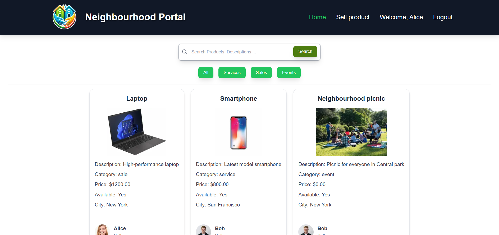

# **Neighborhood Portal**


### **Overview**
Welcome to the **Neighborhood Portal**! This platform enables neighbors to connect, collaborate, and thrive within their local community. Whether you're looking to promote an event, offer a service, or sell a product, the Neighborhood Portal is your one-stop solution.

---

## **Features**
- **Service Listings**: Promote and discover local services like tutoring, repairs, or professional consultations.
- **Product Marketplace**: Buy and sell unique products crafted or sourced by your neighbors.
- **Event Management**: Advertise community events and keep track of local happenings.
- **Authentication**: Secure login and registration using `next-auth` and `bcrypt`.
- **Progressive Web App (PWA)**: Enhanced with `@ducanh2912/next-pwa` for offline capabilities.
- **Seamless User Experience**: Built with `Next.js` and styled using `TailwindCSS`.

---

## **Tech Stack**

| **Category**       | **Technology**                                      |
|---------------------|----------------------------------------------------|
| **Frontend**        | React, Next.js, TailwindCSS                        |
| **Backend**         | Next.js API routes, Prisma ORM                     |
| **Database**        | Prisma with a SQL-compatible database              |
| **Authentication**  | NextAuth, JWT, bcrypt                              |
| **Dev Tools**       | TypeScript, ESLint, Docker                         |

---

## **Installation and Running the App**

The app setup and deployment are simplified into a single command after clonning repository. Here's how to run the app:

### First-Time Setup
1. **Clean Build**
   ```bash
   npm run compose:dev:clean
   ```

2. **Start the App**
   ```bash
   npm run compose:dev
   ```

### Subsequent Runs
- Use the following command to start the app:
   ```bash
   npm run compose:dev
   ```

- If changes are not reflected, rerun the clean build:
   ```bash
   npm run compose:dev:clean
   ```

---

## **Additional Commands**

### **Dependencies**
- Install dependencies:
  ```bash
  npm install
  ```

### **Prisma Commands**
- Generate models:
  ```bash
  npx prisma generate
  ```

- Create migrations:
  ```bash
  npx prisma migrate dev
  ```

- Push changes to the database:
  ```bash
  npx prisma db push
  ```

- Seed the database:
  ```bash
  npx prisma db seed
  ```

- View database schema visually:
  ```bash
  npx prisma studio
  ```

### **Docker Commands**
- Start containers:
  ```bash
  docker compose up
  ```

- If something breaks, try stopping and rebuilding:
  ```bash
  docker compose down
  ```

- Or remove volumes and then rebuild:
  ```bash
  docker compose down -v
  docker compose up --build
  ```

---

## **Environment Variables**
Ensure a `.env` file exists with the required values. Refer to `.env.example` for guidance. Add the following variables:
- `POSTGRES_USER`
- `POSTGRES_PASSWORD`
- `POSTGRES_DB`
- `POSTGRES_PORT`
- `NODE_ENV`
- `AUTH_SECRET`

---


## **Docs for Used Packages**

| Package           | Documentation Link                                  |
|--------------------|----------------------------------------------------|
| **Prisma**         | [Prisma Docs](https://www.prisma.io/docs/orm)      |


---

### **Screenshots**


---

## **Acknowledgments**

- [Next.js](https://nextjs.org/)
- [TailwindCSS](https://tailwindcss.com/)
- [Prisma](https://www.prisma.io/)
- [@ducanh2912/next-pwa](https://ducanh-next-pwa.vercel.app/)

---


